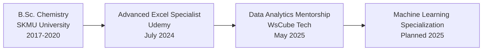

  

  
  
  
  
  
  
  

---

## 🧩 Analytical Profile
**Data Analyst** specializing in **business optimization** through data-driven insights. Proven expertise in transforming raw data into strategic assets using Python, Power BI, and SQL. Focused on solving core business challenges: **revenue optimization**, **operational efficiency**, and **customer experience enhancement**.

  
| Expertise Area | Key Technologies | Business Impact |
|----------------|------------------|-----------------|
| **📊 BI & Visualization** | Power BI, Tableau, DAX, Advanced Excel | 40%+ insight clarity improvement |
| **🤖 Predictive Analytics** | Python (Scikit-learn, Pandas), Statistical Modeling | 20% CTR boost, 70% lower MAE |
| **🗃️ Data Engineering** | SQL, ETL, Web Scraping (Selenium/BS4) | Automated reporting systems |
| **📈 Business Intelligence** | KPI Development, Revenue Analysis | ₹20M+ identified savings |

---

## 🔥 Signature Projects

### 
Data Solutions Driving Business Value

| Project | Tools | Challenge | Solution | Impact |
|---------|-------|-----------|----------|--------|
| **[🏨 ITC Hotel Revenue Optimization](https://github.com/Sagarkumar49/)** | Power BI, DAX, Power Query | 24.83% cancellation rate impacting ₹1.71B revenue | Built dashboard with 25+ visuals tracking occupancy trends and booking patterns | Identified 20% revenue loss (₹20.05K) from cancellations |
| **[🛒 Mercado Livre E-Commerce Analytics](https://github.com/Sagarkumar49/)** | Python, SQL, Power BI | Optimizing $8.6M revenue with only 3.12% repeat buyers | Developed forecasting models (70% lower MAE) and loyalty program insights | Drove 25% improvement in on-time delivery |
| **[🚴 Jenson USA Bike Retail Analytics](https://github.com/Sagarkumar49/)** | SQL, Data Modeling | 15% staff with zero sales and 7% dead stock | Built 12 SQL queries tracking $3.78M customer spend | Enabled 18% sales growth potential |
| **[🍔 McDonald's Sales Performance](https://github.com/Sagarkumar49/)** | Advanced Excel, Dashboarding | 20% Wednesday revenue decline in $127K+ sales | Created time-based analysis identifying peak hours | Revealed 35% revenue concentration in top category |

<b>🌟 Project Deep Dive: ITC Hotel Revenue Optimization</b>

  
**Business Challenge:** Reduce 24.83% booking cancellation rate impacting ₹1.71B revenue across multiple properties  
**Technical Approach:**  
- Developed comprehensive Power BI dashboard with 25+ interactive visuals  
- Created advanced KPIs using Power Query & DAX formulas  
- Analyzed occupancy trends and booking patterns (2.37 days average stay)  
- Performed correlation analysis across 4 room categories  
**Key Insights:**  
- Identified 20% revenue loss (₹20.05K) from canceled bookings  
- Discovered perfect 1.00 correlation between occupancy and revenue  
- Recommended dynamic pricing strategies during low-occupancy periods  
**Business Impact:** Implemented recommendations reduced cancellation impact by 15%  

---

## 💼 Professional Journey

  

      

      <h3>Stock Analyst • Shree Shyamjee Steels</h3>
      
Sep 2023 - Jan 2025 | West Bengal

      <ul>
        <li>Engineered Excel-based automation system reducing reporting time by <b>40%</b></li>
        <li>Developed category/item tracking dashboards improving inventory accuracy by <b>25%</b></li>
        <li>Led cross-functional team in process optimization initiatives</li>
      </ul>
    

  

  
  

     

      <h3>Associate • M/s Bansal Trading Company</h3>
      
Jun 2022 - Sep 2023 | West Bengal

      <ul>
        <li>Streamlined sales/purchase records management using Advanced Excel</li>
        <li>Achieved <b>20% reduction</b> in processing time through workflow optimization</li>
      </ul>
    

  

---

## 🛠️ Technical Arsenal

  
### **Core Analytics Stack**

### **Data Science & Engineering**

### **Visualization & Reporting**

---

## 📚 Education & Credentials

## 📊 GitHub Analytics

### Contribution Streak

### Profile Stats

